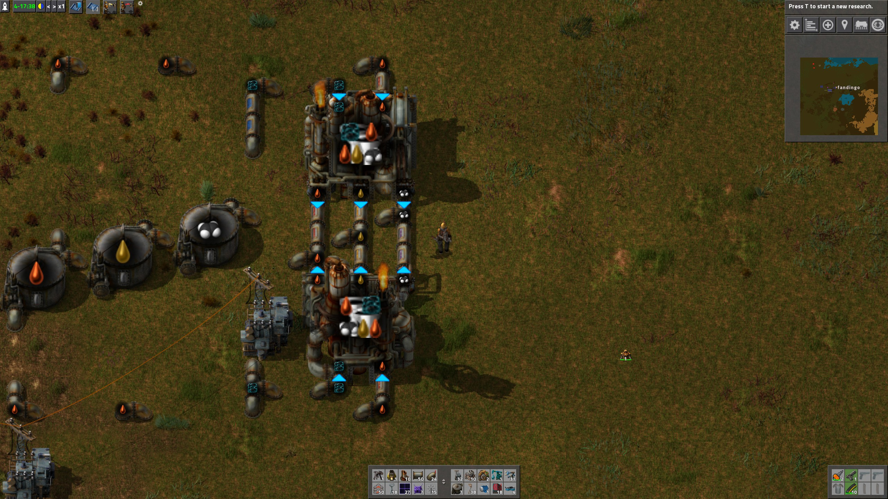
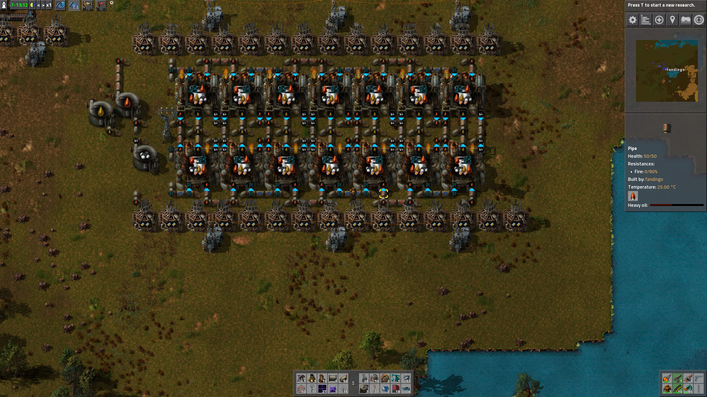

Intro
=====

GDIW_Bergius is a mash-up of two of my favorite Factorio Mods: [GDIW](https://mods.factorio.com/mods/DaCyclops/GDIW) and [Bergius Process](https://mods.factorio.com/mods/Klonan/Bergius_Process).

Bergius process creates receipes to transform coal into oil products (gas, medium, and heavy).

GDIW creates "mirror" recipes for oil production. There are recipes that reverse inputs (eg. water and crude oil for
 advanced oil processing) and also outputs (eg. gas, medium, and heavy oils). This mod is extremely useful for high
 density oil reinfining.

GDIW_Bergius brings "mirror" recipes to Bergius Process. It's nothing fancy just some extra recipes with clear icons. 

Note that this mod does not replace either GDIW or Bergius Process. You'll need to install both mods.

When choosing a recipe in Factorio, the icon that appears in "detail mode" (ALT button) does not rotate with the
 building. This is a Factorio limitation.
 
GDIW_Bergius can be safely added to an existing save.
 

Recipes
=======

The mod includes 4 recipes, although the first one is the same as the default Bergius Process. The recipe names use
 chiral descriptions (N and R) for naming. Each receipe gets two letters to describe the rotations: N for "normal" and R for "rotated."
 The first letter is for inputs and the second for outputs.

Bergius Process (NN)
--------------------

* Default input order
* Default output order

Bergius Process (NR)
--------------------

* Default input order
* Reversed output order

Bergius Process (RN)
--------------------

* Reversed input order
* Default output order

Bergius Process (RR)
--------------------

* Reversed input order
* Reversed output order

Use Case
========

Like GDIW, this mod helps you make cleaner oil refining. It allows you to put the outputs of two refineries directly aligned.

Note how there are only 3 tiles between the two refineries. This is the most dense oil refinery configuration. It scales up very nicely, too:

Note that all 4 recipes are used. The entire top row uses the R (rotated) recipe for outputs, and the bottom row uses
 the N ("normal") recipe for outputs. Additionally, within each row, the input recipe alternates to keep inputs clean.
 
(I use this design with GDIW for advanced oil processing, and created this mod because I wanted the same cleanliness and efficiency.)
 
